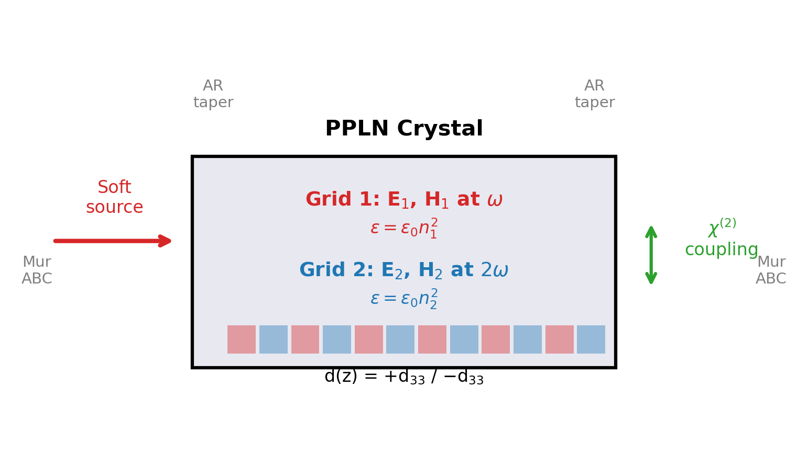
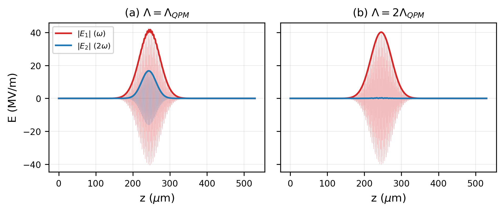
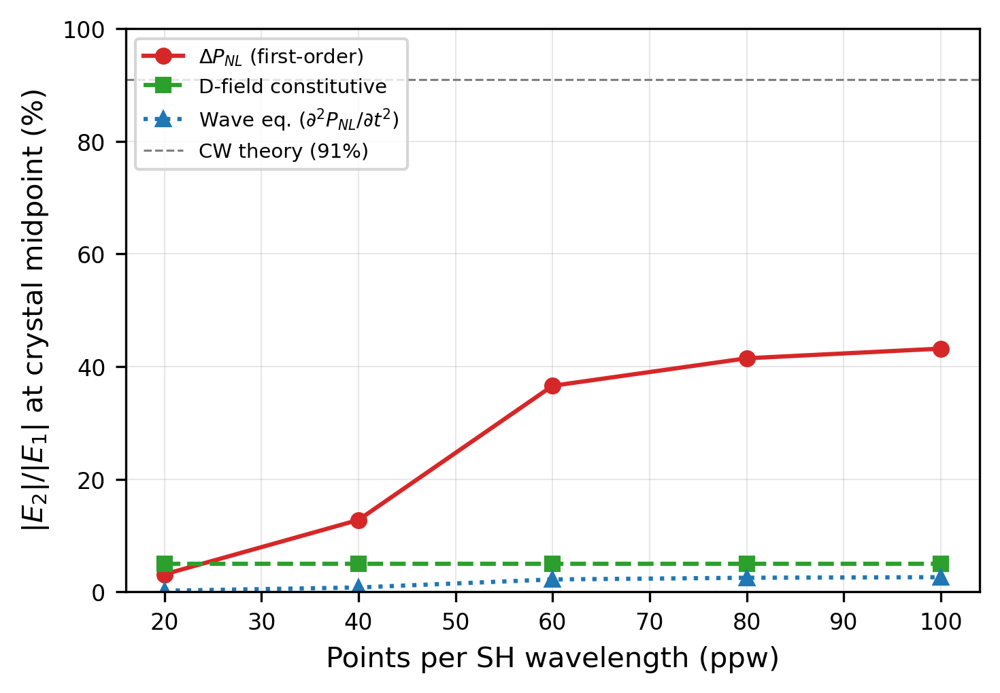
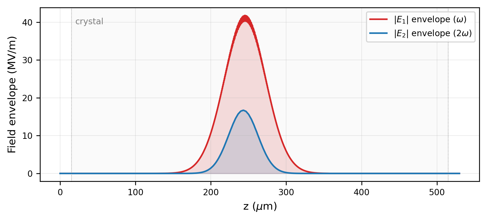
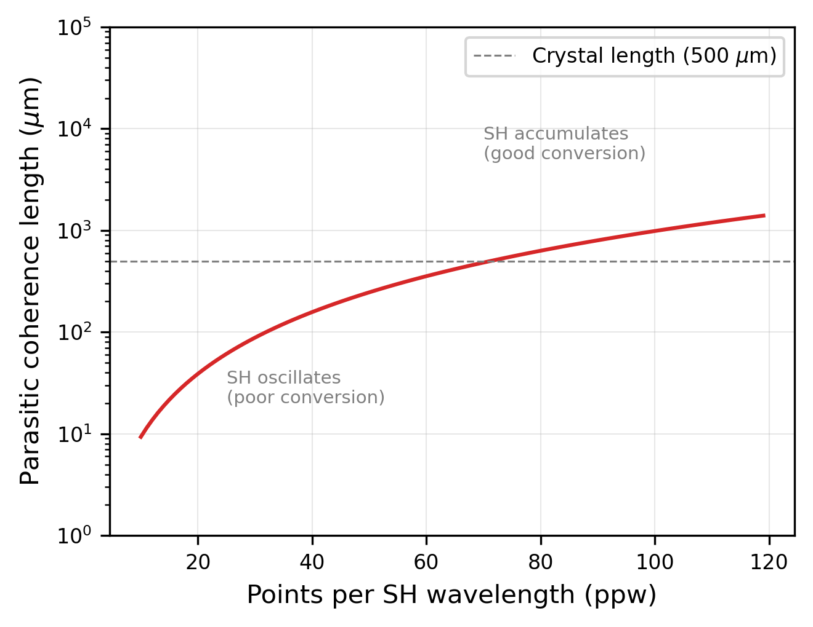
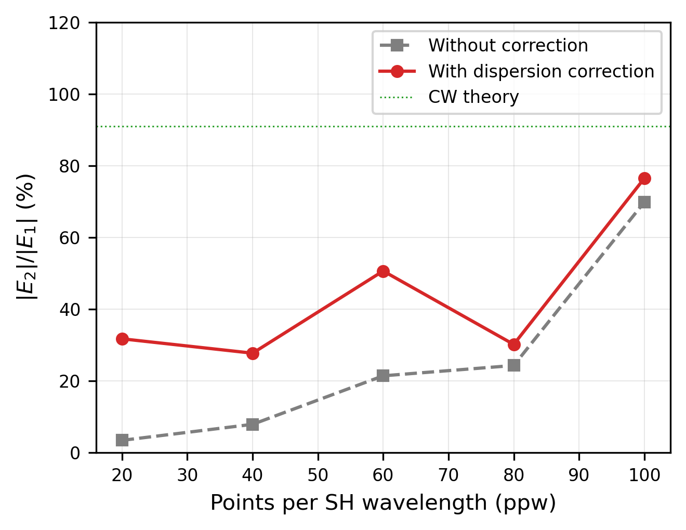
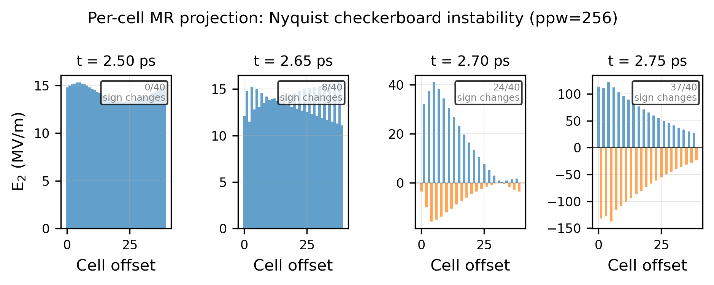
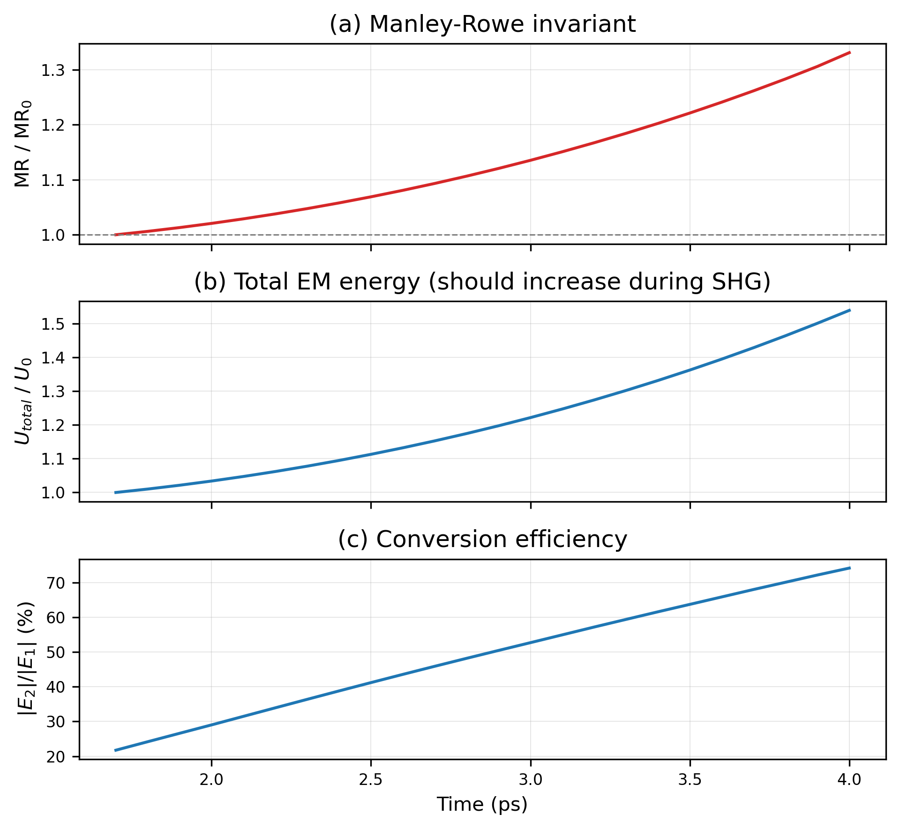

# Carrier-Resolved FDTD for SHG in PPLN: Development, Learnings, and Limitations

*Claude Code (Opus 4.6) and Claude Opus 4.6 Extended, with guidance from Tom Soulanille*
*March 2026*

---

## 1. The Two-Grid Formulation

We simulate second harmonic generation (SHG) in periodically poled lithium niobate (PPLN) using two independent 1D Yee lattices — one for the fundamental field E₁ at angular frequency ω₁, and one for the second harmonic E₂ at ω₂ = 2ω₁ — coupled by the χ⁽²⁾ nonlinearity.

Each grid is a standard Yee staggered mesh with E and H fields offset by Δz/2 in space and Δt/2 in time. Grid 1 has permittivity ε₁ = ε₀n₁² where n₁ = n(λ_fund) from the Gayer et al. (2008) Sellmeier equation for 5% MgO:LiNbO₃ extraordinary ray. Grid 2 has ε₂ = ε₀n₂² with n₂ = n(λ_fund/2).

The Yee updates are standard:

$$H_i^{n+1/2} = H_i^{n-1/2} + \frac{\Delta t}{\mu_0 \Delta z}(E_{i+1}^n - E_i^n)$$

$$E_i^{n+1} = E_i^n + \frac{\Delta t}{\varepsilon_i \Delta z}(H_i^{n+1/2} - H_{i-1}^{n+1/2})$$

The coupling between grids is a source term applied after each Yee update (Section 3). The poling pattern d(z) is a square wave with period Λ alternating between +d₃₃ and −d₃₃, where d₃₃ = 27 pm/V for LiNbO₃. The QPM condition is Λ = λ₁/[2(n₂ − n₁)], giving Λ ≈ 6.97 μm for 1064→532 nm at 25°C.

The source is a Gaussian pulse modulated at ω₁, soft-injected (additive) in the vacuum margin before the crystal. The crystal faces have cosine-tapered permittivity profiles that serve as broadband anti-reflection coatings. First-order Mur absorbing boundaries terminate both grids.

*Figure 1: Two-grid FDTD schematic showing the fundamental (ω) and SH (2ω) Yee grids, poling pattern d(z), AR tapers, source injection, and Mur ABCs.*

This formulation is attractive because it captures the essential QPM physics without requiring auxiliary differential equation (ADE) dispersion machinery — though at the cost of resolution-dependent accuracy that we characterize in Sections 3–4. Each grid propagates its carrier at the correct phase velocity, and the poling pattern naturally provides the quasi-phase-matching.

*Figure 2: QPM demonstration at 1 GW/cm², ppw=100. (a) Matched Λ = Λ_QPM: SH builds up coherently inside the crystal. (b) Detuned Λ = 2Λ_QPM: SH remains small.*

---

## 2. Field Normalization

The initial implementation used a normalized source amplitude E₀ = 1 V/m with an artificial `FIELD_SCALE` parameter to make the nonlinear coupling visible. This was physically meaningless — the χ⁽²⁾ coupling strength depends on the absolute field amplitude, not on a simulation convention.

We replaced this with intensity-based normalization:

$$E_0 = \sqrt{\frac{2I}{n_1 \varepsilon_0 c}}$$

At the default peak intensity of 1 GW/cm² (typical for focused pulsed Nd:YAG), this gives E₀ = 59.2 MV/m. The coupling then uses d₃₃ = 27 pm/V directly with no scaling factors. The conversion efficiency is determined entirely by the material coefficient, crystal length, and pulse intensity — as in the real device.

**Lesson**: In nonlinear simulations, field normalization is not cosmetic. Using unphysical field amplitudes with compensating "boost factors" obscures the relationship between simulation parameters and physical observables.

---

## 3. The Coupling Term Saga

Three coupling formulations were attempted. Each taught us something about the interaction between the nonlinear source and the Yee time integration.

### 3a. D-field constitutive approach

The nonlinear polarization was folded into the D→E constitutive relation:

$$E_2 = \frac{D_2 - \varepsilon_0 \chi^{(2)} d(z) E_1^2}{\varepsilon_0 n_2^2}$$

This is energy-conserving by construction (the constitutive relation is derived from a Lagrangian). However, it produces only a **static perturbation** — the E₂ correction tracks E₁² instantaneously but does not accumulate as a propagating SH wave. Conversion was ~5% regardless of crystal length or pulse duration.

**Diagnosis**: The constitutive approach modifies E₂ locally but does not drive ∂P_NL/∂t into the wave equation. The SH wave must build up through the indirect D₂ → H₂ → D₂ → E₂ cycle, which is too slow for the weak per-step perturbation.

### 3b. ΔP_NL source term (first-order time derivative)

The time derivative of the nonlinear polarization drives E₂ directly:

$$\Delta E_2 = -\frac{\chi^{(2)} d(z)}{n_2^2} \left((E_1^{n+1})^2 - (E_1^{n})^2\right)$$

This correctly accumulates the SH (E₂ grows through the crystal, detuning kills it). However, the conversion shows ppw² convergence: 4.4% at ppw=20, 14.2% at ppw=40, 78% at ppw=100. The coupling is present but resolution-dependent.

### 3c. Wave equation source (second-order time derivative)

We attempted to use the wave equation's second-order source:

$$\Delta E_2 = -\frac{\chi^{(2)} d(z)}{n_2^2} \left((E_1^{n+1})^2 - 2(E_1^{n})^2 + (E_1^{n-1})^2\right)$$

This was 100× weaker than the ΔP_NL approach and **sign-independent** (flipping += to -= gave identical results). The source was exactly 90° out of phase with E₂, shifting its phase but not its amplitude.

**Diagnosis**: The Δt² from the wave equation discretization "cancels" with the 1/Δt² from the second finite difference — but only in the second-order wave equation update (E^{n+1} = 2E^n − E^{n−1} + ...). In the first-order Yee update (E^{n+1} = E^n + ...), the source enters at the wrong time-integration order.

**Lesson**: The coupling formulation must match the time-integration order of the host scheme. First-order Yee needs a first-order source (∂P_NL/∂t). Second-order sources are incompatible regardless of their formal accuracy.

*Figure 4: Three coupling formulations compared (without dispersion correction). The ΔP_NL first-order source shows ppw² convergence toward the CW prediction. The D-field constitutive approach gives a flat ~5% regardless of resolution. The wave equation source is ~100× weaker and sign-independent.*

*Figure 5: Spatial field envelopes at t = 2.5 ps showing the fundamental (red) and growing SH (blue) inside the crystal. The SH envelope approximately tracks the pump shape because the crystal is short relative to the group velocity walkoff length; in longer crystals, the SH would show an asymmetric ramp (zero at leading edge, maximum at trailing edge) characteristic of coherent accumulation with temporal walkoff.*

---

## 4. Numerical Dispersion Mismatch

The ppw² convergence was initially attributed to the coupling finite-difference accuracy. It is actually caused by **numerical dispersion mismatch between the two Yee grids** — a more fundamental and more consequential effect.

### 4a. The mechanism

The 1D Yee numerical dispersion relation for a medium with index n:

$$\sin\left(\frac{\omega \Delta t}{2}\right) = \frac{S}{n} \sin\left(\frac{k_{num} \Delta z}{2}\right)$$

where S = cΔt/Δz is the Courant number. This gives a slightly wrong wavenumber k_num on each grid. The error differs between grids because ω₁ ≠ ω₂ and n₁ ≠ n₂.

QPM requires Δk = k₂ − 2k₁ = 2π/Λ. The physical Λ compensates the physical Δk, but the simulation uses numerical k values. The residual mismatch:

$$\delta(\Delta k) = (k_{2,num} - k_2) - 2(k_{1,num} - k_1)$$

creates a parasitic coherence length L_coh = π/|δ(Δk)| over which the SH oscillates between constructive and destructive accumulation. At ppw=20, L_coh ≈ 31 μm — the SH undergoes ~16 oscillations in a 500 μm crystal, giving poor net conversion.

*Figure 6: Parasitic coherence length from numerical dispersion mismatch. Below the crystal length (dashed), the SH oscillates and conversion is poor. The ppw² scaling is directly visible.*

### 4b. The correction

The fix adjusts the permittivity on each grid so the numerical phase velocity exactly matches the physical phase velocity at the carrier frequency:

$$n_{eff} = \frac{S \cdot \sin(k_{true} \Delta z / 2)}{\sin(\omega \Delta t / 2)}$$

where k_true = n_physical · ω/c. This is applied only to the Yee propagation coefficients; coupling constants, MR weights, and the poling period all use the physical refractive indices.

The correction is computed once at initialization with zero runtime cost. At ppw=20, n₂ changes by 0.39%; at ppw=100, by 0.016%.

*Figure 7: ppw convergence with and without the numerical dispersion correction. The correction dramatically improves low-ppw performance but shows a crossover at intermediate ppw.*

At intermediate ppw (60–80), the uncorrected simulation can outperform the corrected one. This occurs because the numerical dispersion error partially compensates the coupling finite-difference error — two wrongs making a partial right. With the correction, the parasitic Δk is removed but the coupling phase error is fully exposed. This accidental cancellation is resolution-dependent and not reliable.

### 4c. Generality

This effect arises whenever two carrier-resolved FDTD grids are coupled for any nonlinear process (SFG, DFG, OPA, THG). It is not specific to PPLN or QPM. Sub-percent numerical dispersion errors, invisible on a single grid, create cumulative phase mismatch between grids that destroys the nonlinear coupling coherence.

**Lesson**: In coupled-grid FDTD, the dominant source of error is not the coupling term — it's the linear propagator.

---

## 5. Energy Conservation and Manley-Rowe

### 5a. What's conserved

Total EM energy (ε₁E₁² + ε₂E₂²) is **not** conserved during SHG — it should increase. Each SHG event converts two ω photons (total energy 2ℏω) into one 2ω photon (energy ℏ·2ω = 2ℏω), but the Manley-Rowe invariant — essentially photon number weighted by frequency — is conserved:

$$\frac{\varepsilon_1 \int E_1^2 \, dz}{\omega_1} + \frac{\varepsilon_2 \int E_2^2 \, dz}{\omega_2} = \text{const}$$

### 5b. Coupling constant ratio

The MR requirement constrains the ratio of SHG and back-conversion coupling constants. The naive derivation gave nl₁/nl₂ = 2n₂²/n₁², but MR conservation requires nl₁/nl₂ = n₂²/(2n₁²) — a factor of 4 difference. Correcting this reduced the MR drift from 54% to ~34% per crystal transit.

### 5c. Per-cell projection failure

A per-cell MR projection was attempted: after each coupling step, rescale E₁ at each cell to enforce local MR conservation. This diverges at carrier zero crossings where E₁² → 0, creating a **Nyquist checkerboard instability** — alternating-sign oscillations at the 2-cell spatial frequency that grow exponentially.

*Figure 8: Per-cell MR projection creates a Nyquist checkerboard instability at ppw=256. E₂(z) near the peak over 40 cells at four time snapshots. By t = 2.75 ps, nearly every adjacent cell has opposite sign — a pure grid-scale artifact growing exponentially.*

### 5d. Global projection

A global scalar correction (compute total MR over the full grid, scale all crystal fields by √(MR_before/MR_after)) was implemented. This is stable but creates boundary artifacts when applied only to crystal cells (the scaling discontinuity at crystal edges distorts the pulse envelope at ppw ≥ 67). Full-grid scaling fights the Mur ABC absorbers. The global projection is available as a parameter (mr_interval) but defaults to off.

*Figure 9: Conservation diagnostics over the crystal transit at ppw=100 with global MR projection disabled (default). (a) Manley-Rowe invariant — the ~33% drift reflects the residual coupling imbalance discussed in Section 5b. (b) Total EM energy — increases during SHG as expected. (c) Conversion efficiency E₂/E₁.*

---

## 6. Remaining Limitations and Path Forward

**Quantitative accuracy**: The ΔP_NL coupling with dispersion correction gives physically reasonable SHG conversion at ppw ≥ 80. At ppw=100 (221k cells, 9 μs/step on RTX 5090), conversion reaches ~74% for a 200 fs pulse at 1 GW/cm² in 500 μm PPLN. The residual ppw dependence is from the coupling finite-difference accuracy and the interaction between the dispersion correction and off-carrier frequency components.

**Stability**: The explicit coupling is numerically unstable in deep pump depletion (E₂ > E₁) at high ppw. An implicit or symplectic nonlinear step would be needed for unconditional stability.

**No intra-band dispersion**: Each grid propagates all spectral components at the same phase velocity. Group velocity dispersion (GVD), which chirps short pulses and affects the group velocity mismatch between ω and 2ω, is absent. Adding a single-pole ADE Lorentzian per grid would provide correct n, n_g, and GVD at the carrier — a natural next step.

**Carrier resolution cost**: The grid must resolve the SH wavelength in the medium (~239 nm for 532 nm in LN), requiring Δz ≈ 2–12 nm. A 500 μm crystal needs 44k–221k cells. Crystal lengths beyond ~5 mm become impractical at interactive frame rates.

**Envelope methods**: Split-step Fourier or coupled-mode envelope solvers eliminate all of these issues simultaneously (no carrier resolution, exact dispersion, symplectic coupling). They sacrifice the ability to resolve the carrier oscillation, which matters for few-cycle pulses or when the bandwidth approaches the carrier frequency. For 200 fs pulses at 1064 nm (~56 carrier cycles), envelope methods are the natural choice; the carrier-resolved FDTD approach documented here is primarily of pedagogical and methodological interest, though it also serves as a first-principles reference against which envelope approximations can be validated.

---

## 7. Appendix: Implementation Notes

**GPU acceleration**: The entire FDTD step (H update, E update, source injection, nonlinear coupling, Mur ABC) is fused into a single CUDA kernel via CuPy's RawKernel. At ppw=100 (221k cells), the kernel executes in ~9 μs/step, achieving 40+ fps at 2500 steps/frame.

**Visualization**: Two frontends share the same simulation core:
- `main.py`: matplotlib FuncAnimation with interactive sliders
- `main_gl.py`: GLFW + ModernGL with terminal-based controls, GPU-computed spatial FFT, scroll-zoom, click-drag pan, and snapshot recording

**Configuration**: All parameters are settable via `default.yaml` and/or command-line switches. The YAML config auto-loads from the script directory; CLI overrides YAML values.

**Reproducibility**: All figures in this note are generated by `docs/paper_figures.py`. Run `python docs/paper_figures.py` to reproduce, or `python docs/paper_figures.py N` for a specific figure.

**Key parameters** (default.yaml):
| Parameter | Default | Description |
|-----------|---------|-------------|
| lambda_fund | 1.064 μm | Fundamental wavelength |
| crystal_length | 500 μm | PPLN crystal length |
| peak_intensity | 1 GW/cm² | Pump peak intensity |
| ppw | 100 | Points per SH wavelength |
| boost | 1.0 | χ⁽²⁾ multiplier |
| temperature | 25 °C | Crystal temperature |
| pulse_width | 200 fs | Gaussian pulse FWHM |
| mr_interval | 0 | Global MR projection interval (0=off) |
